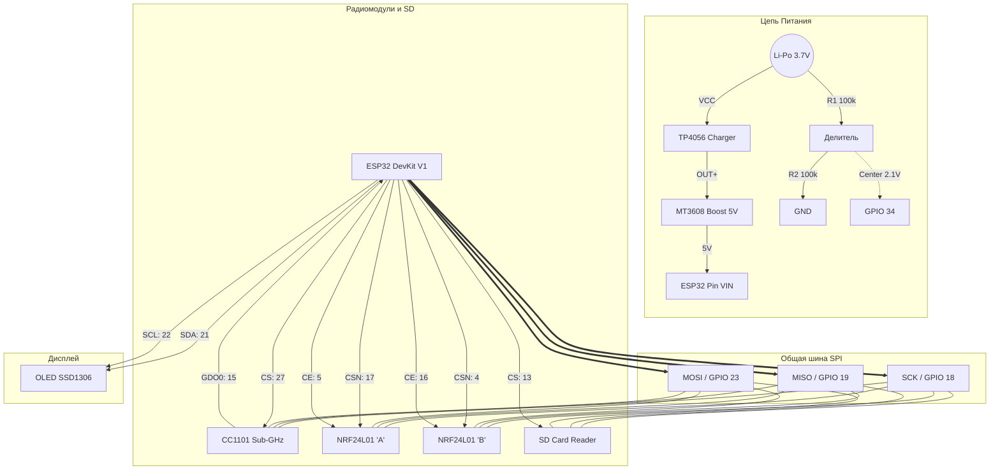

# nRF ghost


**nRF ghost** — это портативный мультитул для пентестинга и исследований радиоэфира на базе микроконтроллера ESP32. Устройство объединяет возможности анализа WiFi, Bluetooth, NRF24 и Sub-GHz протоколов в компактном форм-факторе.

> **⚠️ Проект создан исключительно в образовательных целях и для тестирования на проникновение в собственных сетях.**

---

## 🔥 Возможности (v1.1)

В версии 1.1 полностью переписана архитектура (FreeRTOS), добавлен веб-интерфейс и улучшена стабильность.

### 📡 Радио и Атаки
* **WiFi:** Сканер сетей, Deauth атака, Beacon Spam, **Evil Twin** (с сохранением паролей на SD).
* **NRF24 (2.4 GHz):** Сниффер (Promiscuous mode), Таргетированный **MouseJack** (инъекция нажатий клавиш).
* **Sub-GHz (433 MHz):** Захват (RAW Capture) и воспроизведение сигналов.
    * 🛡️ **Smart Protection:** Автоматическое обнаружение Rolling Code (блокировка Replay для защиты от рассинхронизации динамических ключей).
* **Bluetooth:** BLE Spoofer (имитация устройств Apple/Android/Windows).

## 🚦 Светодиодная индикация (LED Status)

Для оперативного мониторинга без обращения к дисплею предусмотрена цветовая индикация состояний (NeoPixel, GPIO 14):

* 🔵 **Синий:** Режим ожидания (IDLE).
* 🟢 **Зеленый:** Сканирование эфира (WiFi/NRF Scan).
* 🔴 **Красный:** Активная атака (Deauth/Jamming).
* 🟣 **Пурпурный:** Перехвачен Handshake (WiFi).
* 🟠 **Оранжевый:** Обнаружен динамический код (Rolling Code Warning).
* 🧱 **Темно-красный:** Ошибка инициализации оборудования (SD/Radio Fail).

### 🛠 Системные функции
* **Web File Manager:** Управление файлами на SD-карте через браузер (Upload/Download дампов и скриптов).
* **PC-Client Mode:** Управление устройством через Serial-порт с компьютера.
* **Логирование:** Сохранение перехваченных пакетов в `.pcap` (совместимо с Wireshark).

---

## 🔌 Схема Подключения (Hardware Setup)

Устройство использует **общую шину SPI** (Shared SPI Bus). Это критически важно для правильной работы.

### Таблица подключений (Pinout)

| Модуль | Пин Модуля | Пин ESP32 | Примечание |
| :--- | :--- | :--- | :--- |
| **SPI Bus** | **SCK** | **GPIO 18** | Общая линия для всех модулей |
| | **MISO** | **GPIO 19** | Общая линия для всех модулей |
| | **MOSI** | **GPIO 23** | Общая линия для всех модулей |
| **CC1101** | CSN (CS) | GPIO 27 | Chip Select |
| | GDO0 | GPIO 15 | Прерывание (IRQ) |
| **NRF24 (A)** | CSN | GPIO 17 | Chip Select |
| | CE | GPIO 5 | Chip Enable |
| **NRF24 (B)** | CSN | GPIO 4 | Chip Select |
| | CE | GPIO 16 | Chip Enable |
| **SD Card** | CS | GPIO 13 | Chip Select |
| **OLED** | SDA | GPIO 21 | I2C Data |
| | SCL | GPIO 22 | I2C Clock |
| **LED** | DIN | GPIO 14 | WS2812B NeoPixel |
| **Battery** | V_DIV | GPIO 34 | Через делитель напряжения |

### Диаграмма соединений


   
## ⚡ Схема Питания

Для стабильной работы радиомодулей (особенно при глушении) питания от USB или 3.3V регулятора ESP32 может не хватить.

1.  **Аккумулятор:** Li-Po 3.7V (рекомендуется 1000mAh+).
2.  **Зарядка:** Модуль TP4056 (с защитой батареи).
3.  **Повышение напряжения:** Модуль MT3608. Настройте выход на **5.0V** и подайте на пин `VIN` (5V) ESP32.
4.  **Мониторинг заряда (Пин 34):**
    ESP32 не может измерять напряжение выше 3.3V. Используйте делитель напряжения:
    `BAT+` -> **Резистор 100 кОм** -> `GPIO 34` -> **Резистор 100 кОм** -> `GND`.

---

## 🛠 Сборка и Пайка (Assembly Guide)

### ⚠️ ВАЖНЫЕ НЮАНСЫ (TIPS & TRICKS)

1.  **КОНДЕНСАТОРЫ — ЭТО ОБЯЗАТЕЛЬНО!**
    Модули NRF24L01 и CC1101 создают резкие скачки тока при передаче. Без конденсаторов ESP32 будет перезагружаться (Brownout Reset) или радио будет работать нестабильно.
    * **Припаяйте электролитический конденсатор (10uF - 100uF)** прямо на ножки `VCC` и `GND` каждого радиомодуля.
    * Желательно добавить керамический конденсатор **0.1uF** параллельно электролиту для фильтрации ВЧ-помех. 

2.  **Длина проводов SPI:**
    Держите провода шины SPI (SCK, MISO, MOSI) максимально короткими (< 10 см). Длинные провода работают как антенны и вносят ошибки в передачу данных.

3.  **Питание SD-карты:**
    * Если ваш модуль SD-карты имеет встроенный стабилизатор (черная микросхема с 3+ ножками), питайте его от **5V**.
    * Если нет — от **3.3V**.

4.  **Кнопки:**
    Кнопки используют внутреннюю подтяжку (`INPUT_PULLUP`). Второй контакт кнопок подключается к `GND`. Внешние резисторы не нужны.

---

## 💻 Установка Прошивки

Проект разработан для **PlatformIO** (VS Code).

1.  Клонируйте репозиторий:
    ```bash
    git clone [https://github.com/yourusername/nrfbox-pro-v2.git](https://github.com/yourusername/nrfbox-pro-v2.git)
    ```
2.  Откройте папку проекта в VS Code с установленным расширением PlatformIO.
3.  Дождитесь автоматической загрузки библиотек.
4.  **Подготовка SD-карты:**
    * Отформатируйте карту в **FAT32**.
    * Создайте в корне пустой файл `badusb.txt` (или напишите туда свой скрипт на языке DuckyScript).
5.  Подключите ESP32 по USB и нажмите **Upload** (стрелка вправо на нижней панели).

---

## 🚀 Первый Запуск

После прошивки откройте **Serial Monitor** (скорость 115200).

**Правильный лог загрузки:**

```text
[INFO] System Init...
[INFO] SD OK
[INFO] CC1101 Init: OK
[INFO] NRF24 Init: OK
```
### ❓ Возможные проблемы (Troubleshooting)

* **"SD Fail":** Проверьте подключение пина `CS` (GPIO 13) и убедитесь, что карта отформатирована в файловую систему **FAT32**.
* **"CC1101 Fail":** Проверьте целостность проводов шины SPI, стабильность питания модуля и наличие припаянных конденсаторов.
* **Черный экран:** Попробуйте добавить внешние подтягивающие резисторы (**4.7 кОм**) на линии `SDA` и `SCL` к питанию 3.3V.

---

## 🎮 Управление (Controls)

| Кнопка | GPIO | Функция |
| :--- | :--- | :--- |
| **UP** | 26 | Вверх / Увеличить частоту |
| **DOWN** | 32 | Вниз / Уменьшить частоту |
| **SELECT** | 33 | Выбор / Старт атаки / Ок |
| **BACK** | 25 | Назад / Стоп / Отмена |
| **RIGHT** | 2 | Доп. функция (резерв) |

---

## ⚖️ Disclaimer (Отказ от ответственности)

> Данное программное обеспечение и схемы предоставляются "как есть", без каких-либо гарантий. Автор не несет ответственности за любой ущерб, причиненный использованием данного устройства.

**nRFBox Pro** предназначен исключительно для:
1.  Образовательных целей (изучение радиопротоколов).
2.  Тестирования собственных сетей и устройств на уязвимости (с согласия владельца).

**Использование данного устройства для атак на чужую инфраструктуру является незаконным и преследуется по закону. Пожалуйста, используйте ответственно.**
